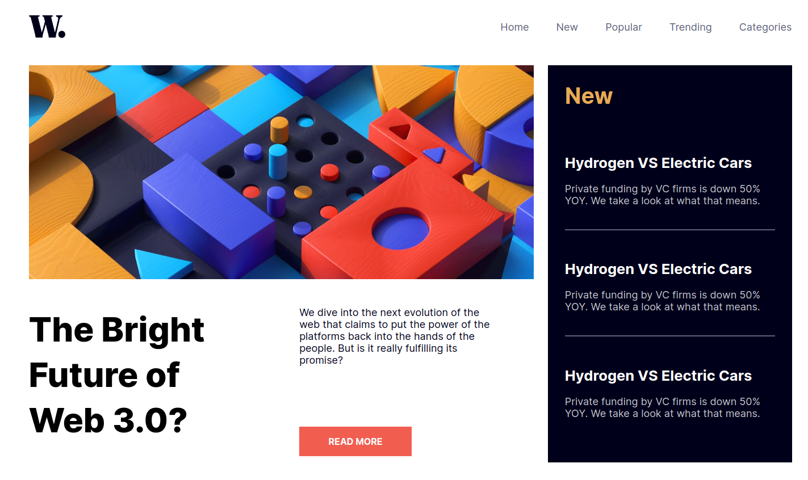

<h1 align="center"> News HomePage </h1>

  Desafio do Front-end Mentor.

  <a href="#tecnologies">Tecnologias</a>&nbsp;&nbsp;&nbsp;|&nbsp;&nbsp;&nbsp;
  <a href="#project">Projeto</a>&nbsp;&nbsp;&nbsp;|&nbsp;&nbsp;&nbsp;
    <a href="#orientations">Orientações</a>&nbsp;&nbsp;&nbsp;|&nbsp;&nbsp;&nbsp;
  <a href="#challenges">Desafios</a>&nbsp;&nbsp;&nbsp;|&nbsp;&nbsp;&nbsp;
  <a href="#extres">Extras</a>&nbsp;&nbsp;&nbsp;|&nbsp;&nbsp;&nbsp;
  <a href="#license">Licença </a>

  

 

  

## 🚀 Tecnologias

 Esse projeto foi desenvolvido com as seguintes tecnologias: 

- HTML, CSS e JavaScript.

## 💻 Projeto

 O News HomePage, como o nome já diz, é basicamente a parte inicial de um site de notícias. Está pagina inicial é um dos mais diversos desafios que existem no Front-end Mentor. Utilizei deste desafio para treinar o Grid CSS. 

## 🗺️ Orientações

<ul id="orientations">
  <li> Apenas tenha em seu computador o npm instalado para instalar as depedências e rodar a aplicação com o comando "npm run dev".</li>
</ul>

## ⚔️ Desafios enfrentados

 A parte mais difícil deste projeto foi deixar responsivo. O projeto não ficou perfeito, mas tenho certeza que ficou bom.

## 🧑‍🔧 Extras

 
  Algumas Melhorias que podem ser feitas por eu ou até mesmo por você caso queira no futuro:

  <ul style="margin-left: 20px">
      <li> Implementar SASS. </li>
  </ul>

## Licença

Esse projeto está sob a licença MIT. </a>